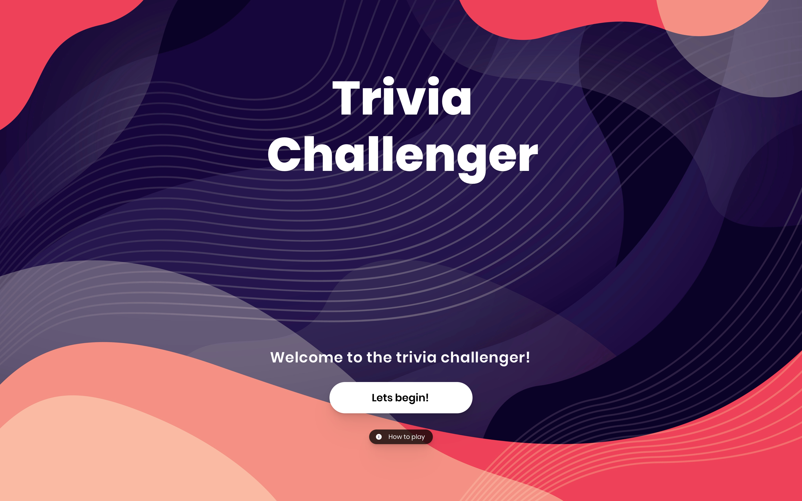

Results from Ligonier Code Challenge: 

# Trivia Game Coding Challenge

[Live demo](https://603d4d0fe2d59d0ef77b33ba--dreamy-lovelace-57ebd4.netlify.app/)

## Overview

Project was build with :

- Gatsby (default starter)
- TypeScript
- Redux, Redux-thunk
- Styled-components

## Goals

Develop the application based off the API, functionality description, and wireframes below using **advanced techniques** and **industry best practices**. Note that the wireframes **are not** complete on purpose; use your best judgment for UI/UX implementation. **Please do not use a Gatsby starter (other than the basic starter) or other boilerplate for this challenge.** We want to see how you structure your project and what tooling you use from scratch.

### TODO:

- Change Favicon
- Service workers
